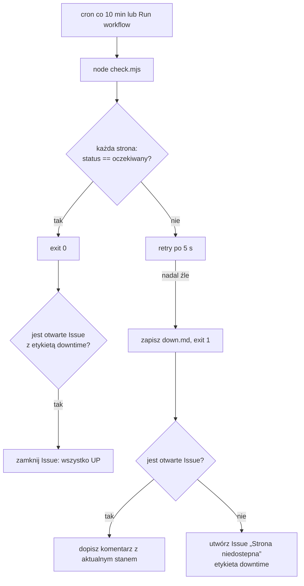

# Architektura

Jedna strona dla kogoś, kto widzi to repo pierwszy raz. Całość to trzy pliki i jeden workflow —
i tak ma zostać.

## Po co to istnieje

Strony klientów MAS Group mają paść zauważone przez nas, nie przez klienta. Płatny SaaS
(UptimeRobot, Pingdom) rozwiązuje to za abonament i kolejne konto do pilnowania; tutaj to samo
robi harmonogram GitHub Actions, który i tak jest opłacony w ramach repozytorium.

## Z czego się składa

| Plik | Rola |
|---|---|
| `sites.json` | Jedyne miejsce z listą monitorowanych stron: `name`, `url`, opcjonalnie `expect_status`. Edycja tego pliku to cała „konfiguracja". |
| `check.mjs` | Ping wszystkich stron: `fetch` z limitem 15 s, jedna ponowna próba po 5 s, porównanie kodu odpowiedzi z oczekiwanym. Zapisuje `down.md` i kończy się kodem 1, jeśli cokolwiek padło. Node 20, zero zależności. |
| `.github/workflows/uptime.yml` | Harmonogram co 10 minut (`cron: */10 * * * *`) plus ręczne uruchomienie. Uprawnienia zawężone do `contents: read` + `issues: write`. |
| `.github/workflows/quality.yml` | Bramka jakości repo (lint, testy, skan sekretów) — dotyczy kodu monitora, nie monitorowanych stron. |

## Przepływ

Alert to powiadomienie GitHuba o Issue — dociera tam, gdzie już patrzysz. Jedno Issue na całą
awarię (kolejne pady to komentarze), więc skrzynka nie puchnie przy dłuższej niedostępności.

## Świadome ograniczenia

- **Interwał 10 minut, nie sekundy.** `schedule` w GitHub Actions bywa opóźniony przy dużym
  obciążeniu — to monitoring „wiemy w kwadrans", nie SLA z sekundową precyzją.
- **Sprawdzamy kod HTTP, nie zawartość.** Strona, która zwraca 200 z pustym HTML-em (zdarzyło
  się to na produkcji jednego z projektów), przejdzie ten test. Rozszerzenie o asercję treści
  to zmiana w `check.mjs` plus pole w `sites.json` — świadomie odłożona, dopóki nie jest
  potrzebna.
- **Brak historii.** Nie zbieramy metryk czasu odpowiedzi ani statystyk dostępności; jedynym
  śladem jest Issue. Gdyby to było potrzebne, właściwym miejscem jest osobne narzędzie, a nie
  rozrastanie tego repo.
- **`continue-on-error` przy kroku ping jest celowe**: krok ma zwrócić informację, a decyzję o
  Issue podejmują kolejne kroki. To jedyne miejsce, gdzie ten wyjątek jest dozwolony.

## Dodanie strony

Jeden wpis w `sites.json` i push. Nic więcej — brak sekretów, brak zmiennych środowiskowych,
brak konfiguracji w UI.
